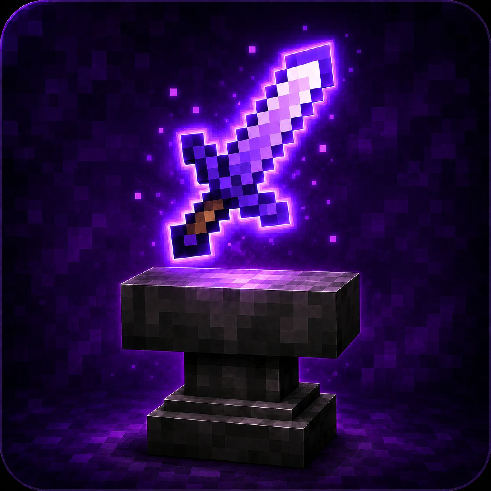
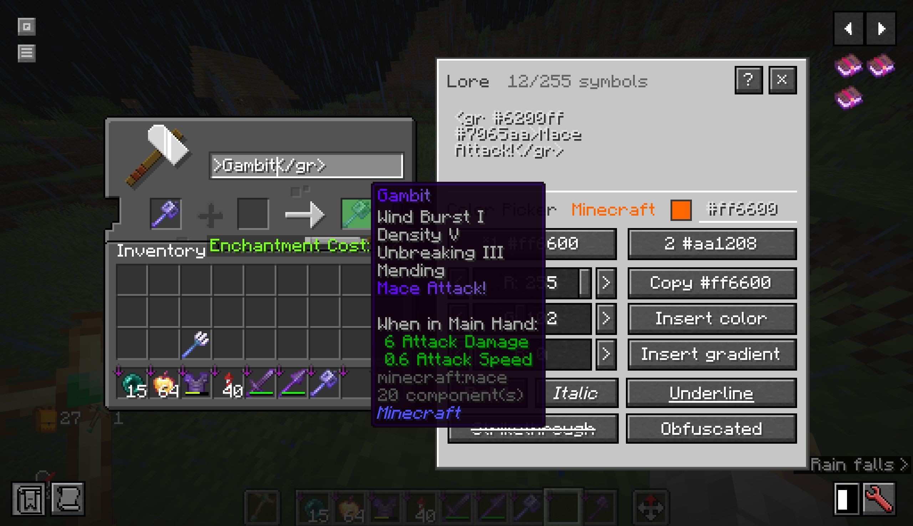
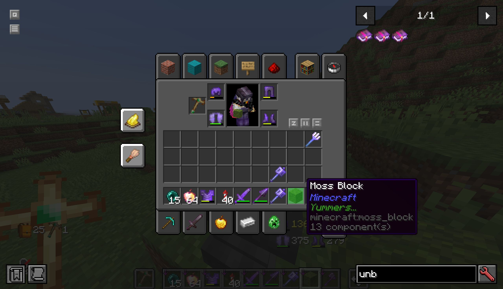
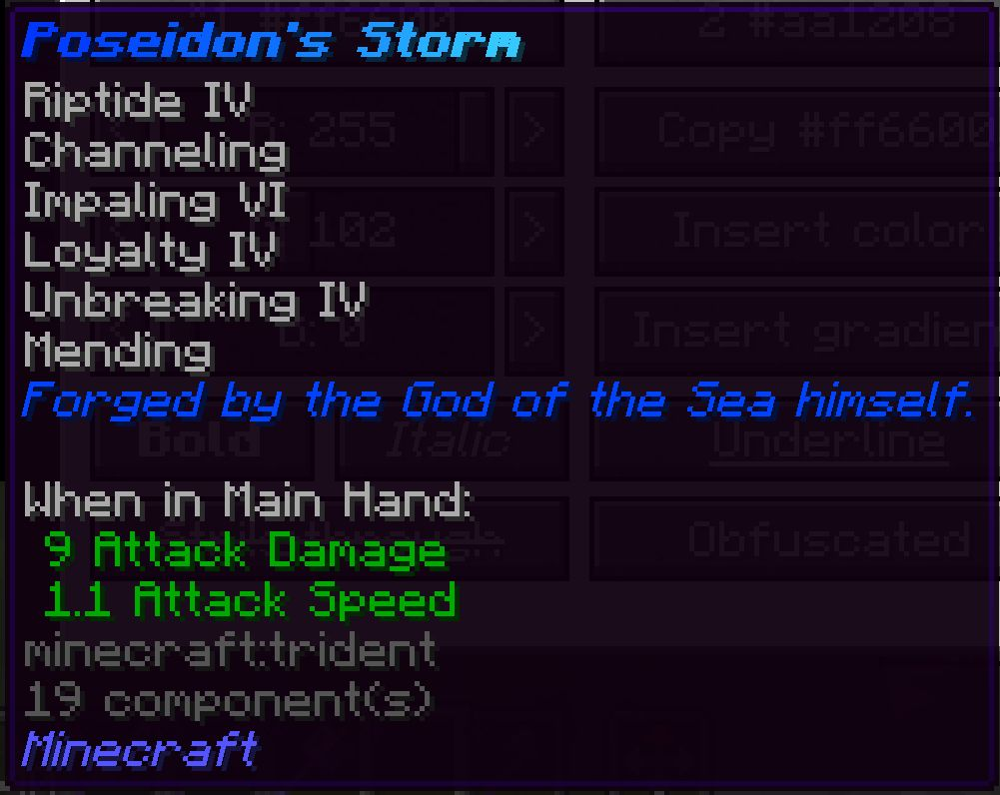

<p align="center">
  
</p>

<h1 align="center">Better Lore</h1>

<p align="center">
  <strong>A vanilla-friendly anvil editor for colored item names and lore.</strong>
</p>

<p align="center">
  <a href="https://modrinth.com/mod/better-lore" target="_blank">
    
  </a>
  <a href="https://modrinth.com/mod/better-lore" target="_blank"><b>Modrinth</b></a> | 
  <a href="https://www.curseforge.com/minecraft/mc-mods/better-lore" target="_blank"> 
    
  </a> 
  <a href="https://www.curseforge.com/minecraft/mc-mods/better-lore" target="_blank"><b>CurseForge</b>
  </a> | 
  <a href="https://github.com/Reign3r/betterlore" target="_blank"> 
    
  </a>
  <a href="https://github.com/Reign3r/betterlore" target="_blank"><b>GitHub</b>
  </a> | 
  <a href="https://github.com/Reign3r/betterlore/issues" target="_blank"> 
    
  </a> 
  <a href="https://github.com/Reign3r/betterlore/issues" target="_blank"><b>Issues</b>
  </a> | 
  <a href="https://ko-fi.com/reign3r" target="_blank">
    
  </a>
  <a href="https://ko-fi.com/reign3r" target="_blank"><b>Support on Ko-fi</b></a>
</p>

## What is Better Lore?

Better Lore adds a survival-friendly extension to the anvil. You can now create unique items by customizing your name or adding lore to them using anvil!

## Features

- Add lore to any item through the anvil.
- Color and format item names.
- Add multiline, colored, formatted lore.
- Pick colors with RGB sliders, direct hex input, or a color wheel.
- Lore changes add one extra level to the anvil cost (will be configurable in the future).
- Layout compatibility with JEI and REI.

## QuickText examples

Tags used:

```text
<c #ff6630>Fire</c>
<gr #ff6630 #dbffa9>Sunlit Relic</gr>
<b>Bold</b>
<i>Italic</i>
<underlined>Underlined</underlined>
<st>Strikethrough</st>
<obf>Obfuscated</obf>
```

## Showcase

<div style="max-width: 400px; height: auto">
<h3>Mace example</h3>



<h3>Yummers?</h3>



<h3>Trident with some lore</h3>



</div>

## Installation

### Requirements

- Minecraft Java Edition 26.1.2
- Fabric Loader
- Fabric API
- Text Placeholder API

Fabric API and Text Placeholder API are required dependencies. Install them alongside Better Lore.

### Client and server behavior

Install Better Lore on the **server** to enable anvil-based lore and name editing.

Install Better Lore on the **client** to use the custom anvil UI. Players without the client mod can still join a modded server, but they will only see the normal vanilla anvil screen.

## Support the project

If Better Lore is useful for your server, modpack, or roleplay setup, consider <a href="https://ko-fi.com/reign3r">supporting the development on Ko-fi</a>. It helps keep the mod maintained, tested, and updated. Thank you!
